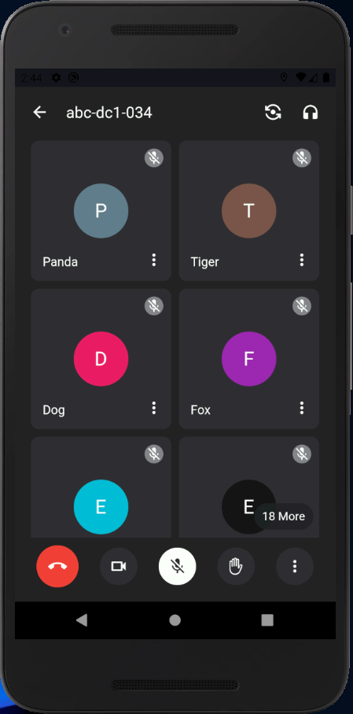
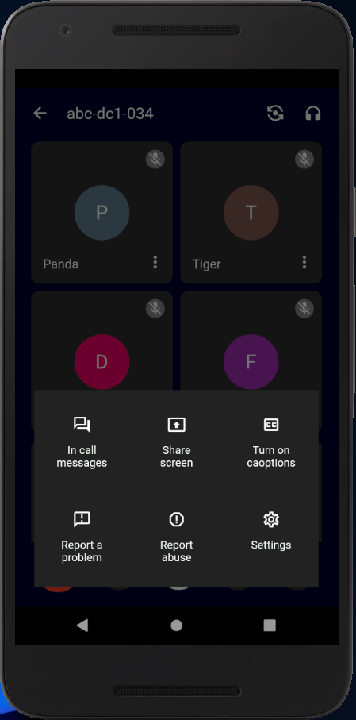
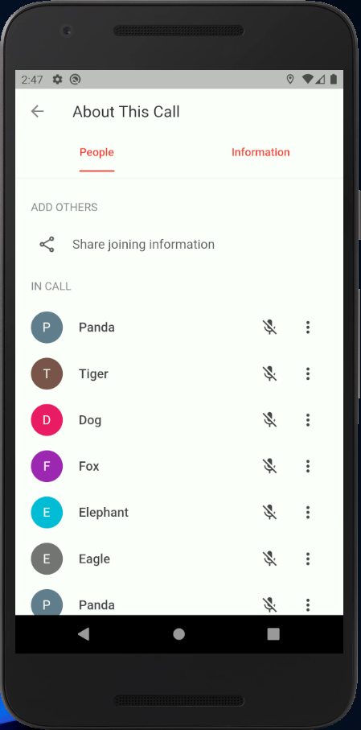
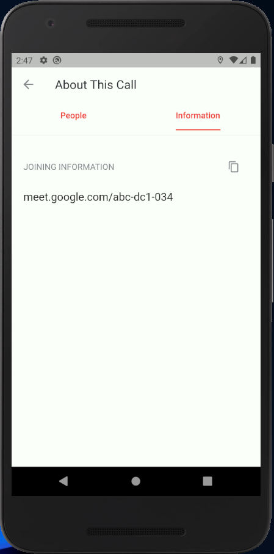
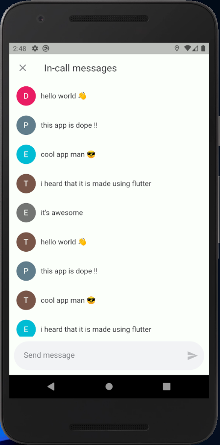
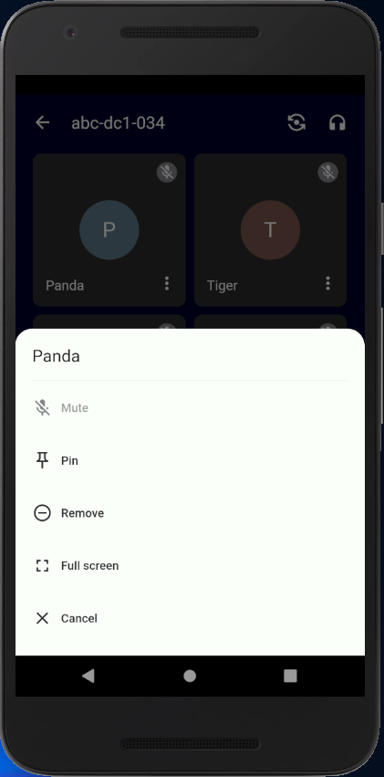

# GOOGLE MEET CLONE

Google Meet UI Clone Using <a href="https://flutter.dev">__Flutter__</a> 🐦

The app include following screens of app

- Home screen
- Message screen
- Info screen

<a href="https://github.com/your-code-is-my-property/google-meet-clone/raw/demo/apk/google-meet-demo.apk">Download The APK demo</a>

### SCREENSHOTS 🖼️

|

|

|

### SETUP 👷‍♂️

> You need <a href="https://flutter.dev">Flutter</a> installed to run this project

Download This Project

```bash
$ git clone <CURRENT-PAGE-URL>
```

Install stuffs

```bash
$ flutter pub get
```

Run the project

```bash
$ flutter run
```

